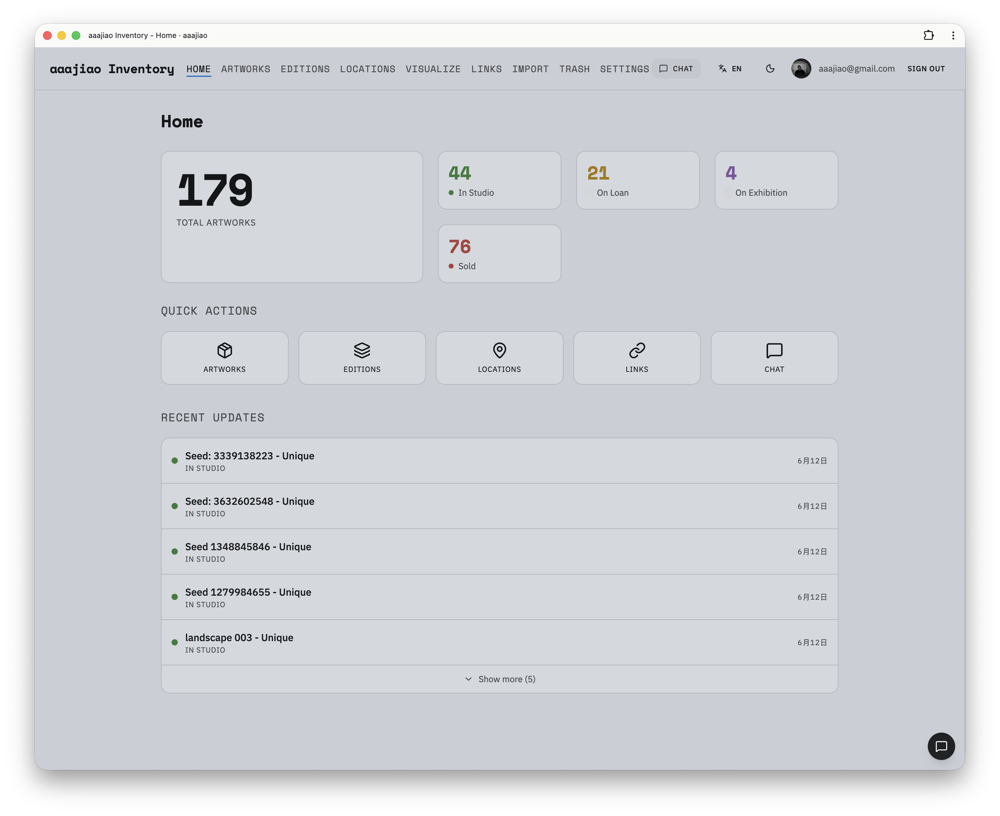
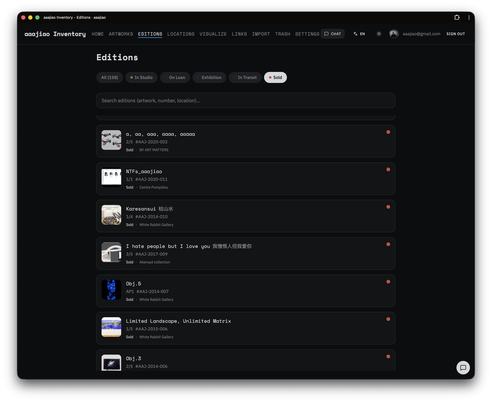
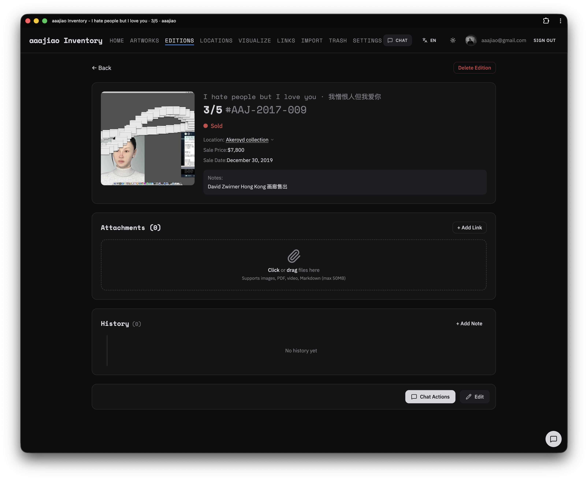
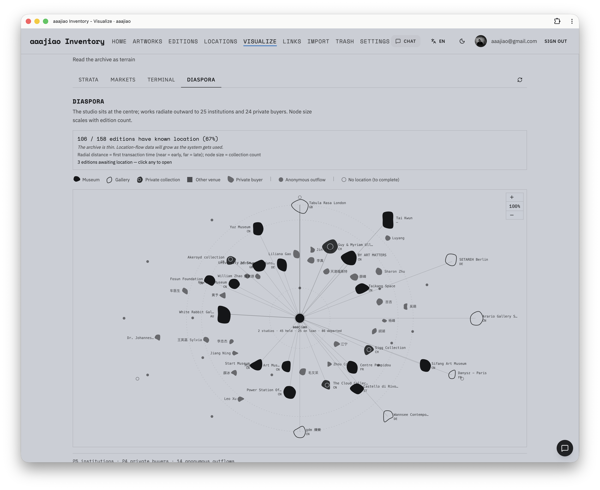
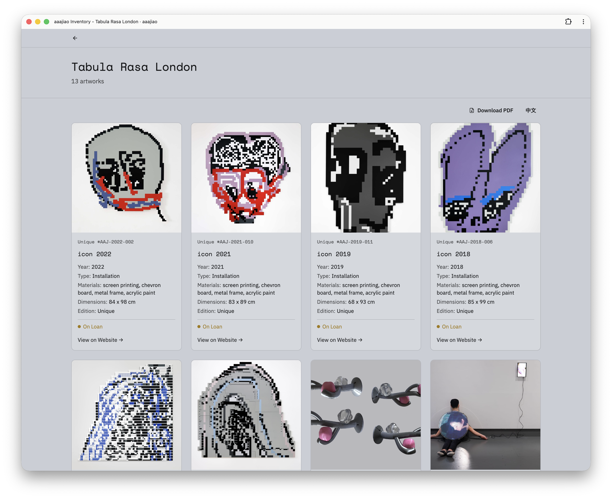

# AIS - aaajiao 作品库存管理系统

艺术家 aaajiao 的作品库存管理系统。通过 AI 对话界面管理作品版本的全生命周期。

## 核心功能

- **作品管理** - 记录作品信息，软删除与回收站
- **版本追踪** - 管理 edition 状态流转（in_studio → at_gallery → sold...）
- **AI 对话** - 自然语言查询和操作（"Guard 1/3 卖了，5万美金"）
- **URL 导入** - 对话中输入「导入 https://...」自动抓取网页创建作品
- **公开链接** - 为位置创建分享链接，可控制价格可见性
- **可视化** - 把整个 archive 当作可读的地形：4 个视图（Strata / Markets / Terminal / Diaspora），实时数据，单色 SVG 美学
- **外部 API** - API Key 鉴权 + 只读结构化查询端点，供外部 AI 代理访问
- **数据导出** - PDF / Markdown / JSON（设置页备份：JSON + MD；列表/详情页：MD；公开画廊：PDF）
- **离线支持** - PWA + IndexedDB 缓存，断网可查看
- **国际化** - 中文 / English

## 界面预览

点击任意截图可查看高清原图。

<p align="center">
  <a href="screenshots/home-dashboard.png?raw=true">
    
  </a>
  <br>
  <strong>首页总览</strong><br>
  <sub>作品库存概况、快捷操作与最近更新。</sub>
</p>

<table>
  <tr>
    <td width="50%" valign="top">
      <a href="screenshots/editions-list.png?raw=true">
        
      </a>
      <strong>版数列表</strong><br>
      <sub>按状态与位置浏览作品版数。</sub>
    </td>
    <td width="50%" valign="top">
      <a href="screenshots/edition-detail.png?raw=true">
        
      </a>
      <strong>版数详情</strong><br>
      <sub>单版作品的档案、附件与历史记录。</sub>
    </td>
  </tr>
  <tr>
    <td width="50%" valign="top">
      <a href="screenshots/visualize-diaspora.png?raw=true">
        
      </a>
      <strong>可视化 / Diaspora</strong><br>
      <sub>作品流转及工作室与艺术机构、藏家的关系。</sub>
    </td>
    <td width="50%" valign="top">
      <a href="screenshots/gallery-share-tabula-rasa.png?raw=true">
        
      </a>
      <strong>画廊分享</strong><br>
      <sub>Tabula Rasa London 的公开作品页面，支持 PDF 导出。</sub>
    </td>
  </tr>
</table>

## 技术栈

| 层级 | 技术 |
|------|------|
| 前端 | React 19, TypeScript 5.9, Vite 7, TailwindCSS 4 |
| UI | shadcn/ui (Radix), Lucide Icons |
| 数据 | TanStack Query + Virtual, react-i18next |
| 后端 | Vercel Functions |
| 数据库 | Supabase (PostgreSQL + Storage + Auth) |
| AI | Vercel AI SDK + Claude / GPT |
| 离线 | vite-plugin-pwa, IndexedDB |

## 开发

```bash
bun install
bun start          # 前端 + API (port 3000)

# 或分别启动
bun run dev        # 前端 (port 5173)
bun run dev:api    # API (port 3000)
```

## 环境变量

```bash
VITE_SUPABASE_URL=
VITE_SUPABASE_ANON_KEY=
SUPABASE_SERVICE_KEY=          # Sensitive
ANTHROPIC_API_KEY=             # Sensitive
OPENAI_API_KEY=                # Sensitive
ALLOWED_EMAILS=                # 服务端白名单（实际安全边界）
VITE_ALLOWED_EMAILS=           # 客户端 UX，必须与 ALLOWED_EMAILS 同值
```

> `ALLOWED_EMAILS` 与 `VITE_ALLOWED_EMAILS` 必须同时配置且值一致。服务端变量是实际安全边界，`VITE_` 那个只控登录页 UX（会打包进 client JS）。v1.3.5 起 production 缺 `ALLOWED_EMAILS` 会 fail-closed。

## 文档

- `CLAUDE.md` - 项目开发指南
- `docs/database.md` - 数据库部署、字段说明、RLS
- `docs/local-dev.md` - 本地开发说明
- `docs/api-reference.md` - AI 工具和 API 端点
- `docs/external-api.md` - 外部 API（API Key 结构化查询）
- `docs/visualize.md` - 可视化页面（4 视图）
- `docs/style-guide.md` - UI/UX 设计规范

## License

MIT
